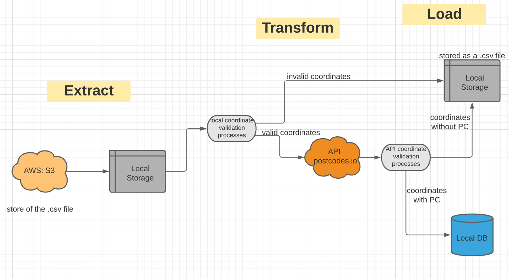

# MiÁguila - postcodes challange

## _Astesana's Solution_

## 1- ETL Diagram



## 2- How process works

The `Main.py` file contains the function `wrapper` that init the ETL process. The args of the function are:

`wrapper(s3_subdir, file_name, local_subdir, batch_size, queries_per_sec)`
where:

- **s3_subdir**: is the path between the bucket's name, and the file name ("postcodesgeo.csv") into AWS S3.
- **file_name**: is the name of the file ("postcodesgeo.csv") stored into AWS S3.
- **local_subdir**: is the local path where the file to be processed will be downloaded.
- **batch_size**: is the number of rows taken from "postcodesgeo.csv"  processed and load into the local DB each
  iteration.
- **queries_per_sec**: is the max number of request that can be performed to the "https://postcodes.io/" API per second.

_Steps of execution of `wrapper` function:_

1. Connection with AWS S3 is established and "postcodesgeo.csv" file is downloaded (if not exist) to the local storage (
   default: "
   /data"). Also, "postcodesgeo.csv.txt" file is created (if not exist) and here the index of the last processed row is
   saved.
2. A batch with length **batch_size** is processed. The invalid coordinates (those that are not float) are saved
   temporally into a df named "df_invalids", and the valid coordinates are sent to the postcodes.io API to obtaining the
   postal code. Then, the coordinates without PC are appended to those saved into "df_invalids".
3. Finally, valid coordinates are saved into postgresql DB in the "post_code" table and the transactions are saved into
   the "transaction_log" table. In the other side, all the non valid coordinates are stored locally ("/data")
   into a file named ("invalidpostcodesgeo.csv")

## 3- Requirements and how init process

1. `.env` file must be created and filled

```
#   Data Base
DB_USER=YOUR_DB_USER
DB_PASS=YOUR_DB_PASS
DB_PORT=YOUR_DB_PORT
DB_NAME=YOUR_DB_NAME

#   AWS
ACCESS_KEY_ID=SENT_IN_THE_MAIL
SECRET_ACCESS_KEY=SENT_IN_THE_MAIL
BUCKET=SENT_IN_THE_MAIL
```  

2. `requirements.txt` must be pip installed
3. Run `Main.py` and the process should start. You can stop the process whenever you want. When you rerun the `Main.py`
   file the process will start from last row processed.

## 4- Do all the coordinates sent to the database have a zip code?

Yes. The coordinate validation process consists of 2 steps. First, using the `invalids_coordinates(batch)` function
invalid coordinates (those that are not floating)are temporally stored in a df named "df_invalids"
function `api_get_batches(df_valid, queries_per_sec)`). Then, the coordinates without PC are appended to those saved
into "df_invalids". Finally, valid coordinates are saved into postgresql DB in the "post_code" table and the
transactions are saved into the "transaction_log" table. In the other side, all the non valid coordinates are stored
locally ("/data") into a file named ("invalidpostcodesgeo.csv")

## 5- Performing limit controller for API queries.

The function named api_get_batches is the one that perform async queries to the "https://postcodes.io/" API. Here I used
grequest and time libraries for limitting the max number of petitions that can be performed per minute to the API. The
máx number of petitions can be changed withe the variable **queries_per_sec**

## 6- Git /Git Flow

How the work was done just for me and it was quite simple, it was not imperative to use Git Flow methodology. I know the
importance of using Git Flow and I used this methodology in the past. We implement it using at least 2 branches. 1 for
production (master) and other for develop (develop).

## 7- Good Practices Performed

- Pep-8
- OOPs

## 8- Unit test

- unittest library
- You can try this test running `UnitTests.py` file